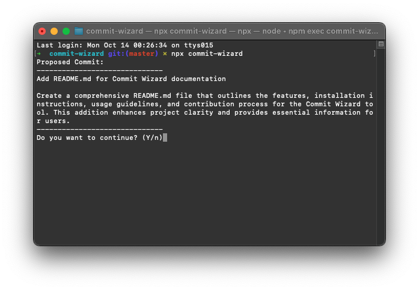
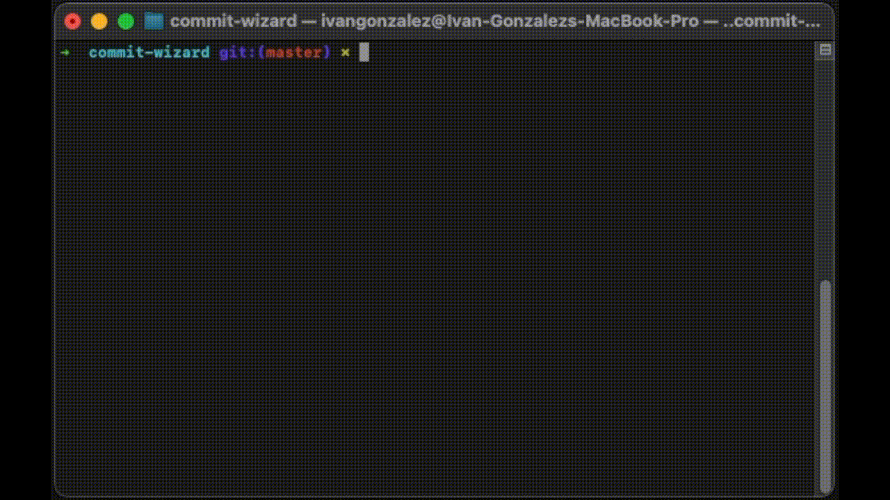

# 🧙‍♂️ Commit Wizard

> Automagically generate clear and concise commit messages using OpenAI and Git. Perfect for keeping your Git history clean, organized, and magical! ✨



## 🚀 Features

- ✨ **AI-powered**: Uses OpenAI to generate meaningful commit messages based on your staged changes.
- 💻 **CLI tool**: Simple command-line interface for fast and efficient workflow.
- 📋 **Consistent formatting**: Ensures your commit history follows best practices.
- 🎯 **Customizable**: Exclude files or customize the prompt for tailored commit messages.

---

## 📦 Installation

You can install **Commit Wizard** globally using npm:

```bash
npm install -g commit-wizard
```

Or use it directly with `npx` without installation:

```bash
npx commit-wizard
```

---

## ⚙️ Usage

Once installed, you can use the tool in any git repository.

1. **Stage your changes** as usual:

   ```bash
   git add .
   ```

2. **Run Commit Wizard**:

   ```bash
   commit-wizard
   ```

   Or, with `npx`:

   ```bash
   npx commit-wizard
   ```

3. **Confirm the commit message**:
   After generating the commit message, you'll be asked to confirm if you want to proceed with the commit.

   

---

## 🛠️ Options

- **Custom Prompt**: You can customize the AI prompt by passing the `--message` or `-m` flag.

  ```bash
  commit-wizard --message "Explain what changed in the codebase"
  ```

- **Exclude Files**: Exclude specific files from the commit message generation.

  ```bash
  commit-wizard --exclude "README.md"
  ```

---

## 📸 Demo

Check out how easy it is to use **Commit Wizard**:



---

## 🧑‍💻 Contributing

We welcome contributions! To get started:

1. Fork the repository.
2. Create a new branch (`git checkout -b feature-branch`).
3. Make your changes.
4. Submit a pull request!

---

## 👩‍🚀 Author

Made with ❤️ by [Ivan Gonzalez](https://github.com/ivangonzalezg).

---

## 📄 License

This project is licensed under the MIT License - see the [LICENSE](./LICENSE) file for details.
